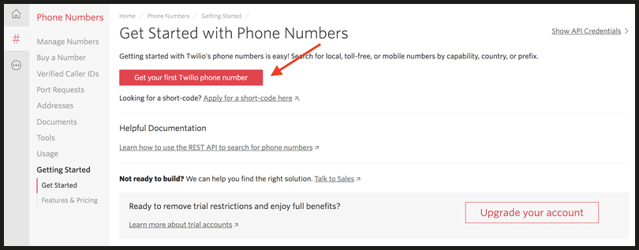
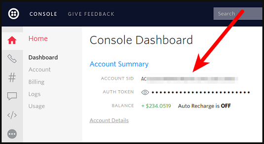
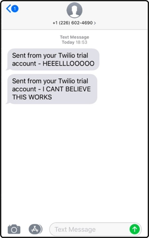

### To Send An Programmable SMS To Others Through <code>[Twilio](https://www.twilio.com/docs/sms)</code> API , Follow The Steps Mentioned Below:   💻➡✉

 

<strong>Step-1: </strong>Create A Free Twilio Account.
   - You Can Create One, Here [Create Account](https://www.twilio.com/try-twilio).

 

<strong> Step-2 : </strong> Once You Have Created An Account, Get Your Free Twilio Phone Number Verified,And Build A Programmable SMS Project.
  

<strong>Step-3: </strong> Once You Got Your Twilio Number, All You Need To Do Is Just Grab Two Things And Paste It In Your Source File.
   - Find Your <code>ACCOUNT_SID</code> And <code>AUTH_TOKEN</code> From Your Console On Twilio.
  
 

 
 
 
   
 
 <strong> Step-3 : </strong> Now Replace The <code>ACCOUNT_SID</code> And <code>AUTH_TOKEN</code> In Your Source Code.
 - In This Case I Have Build Programmable SMS Using Java , And I Have Source Code For Python Too In <code>Src</code> Folder.
 - If You Want To Build This Project Using Some Other Language, Check Out Here 👉🏻 [Source Code](https://www.twilio.com/docs/sms/send-messages#send-an-sms-with-twilios-api)
   
   
<strong> Step-4 : </strong> Now Enter Your Twilio Number In <code>from</code> Parameter And Your Receiver Number In <code>to</code> Parameter In Your Source Code.

 

<strong> The Final One :</strong>  Run The Program And Guess What, Bingo 🥳. Your Reciever Would Have Got A Message Which Is Similar To The Image Shown Below :
 

  

  
 

<strong>Uses  Of Twilio SMS API : </Strong> <code>[Uses-Of-Twilio-API](https://www.twilio.com/docs/glossary/what-is-sms-api-short-messaging-service#:~:text=A%20SMS%20API%20is%20well,networks%20and%20the%20wider%20web.)</code>

 
 <strong>Note:</strong> If You Have Followed All These Steps Correctly, Then It Would Have Worked For You As Well.

  
 <strong>Dev-Note :</strong>You Might Be Thinking, Why To Do These Many Steps, Instead Of Opening Your SMS App And Send Them Directly(Sometimes You Need To Pay For It 😋)
 - Well By Doing These, You Can Learn And Evolve As A Good Developer, Which Yields You Something In Return .
 - And Don't Use This API To Spam Your Friends, Because They Have Your Identity Verified , So Use It Wisely.

 

#### 🔹 For More Help ,Feel Free To Visit Here 👉🏻 <code>[Help](https://www.twilio.com/docs/sms/tutorials/how-to-send-sms-messages)</code>

