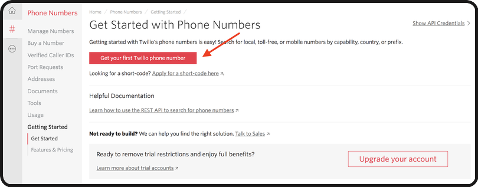
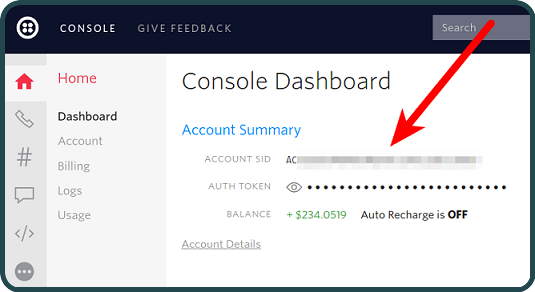

### 💬 Send programmable SMS to others through <code>[Twilio](https://www.twilio.com/docs/sms)</code> API , Follow the steps mentioned below: 
 

<strong>Step-1: </strong>Create A Free Twilio Account.
   - You Can Create One, [Here](https://www.twilio.com/try-twilio).

 

<strong> Step-2: </strong> Once you have created an Account, Get your free Twilio phone number verified, and Build a Programmable SMS Project.
  

 

<strong>Step-3: </strong> Then all you need to do is just grab two things and paste it in your source file.
   - Find your <code>ACCOUNT_SID</code> and <code>AUTH_TOKEN</code> from your console on twilio.
  
 

 
 
 
  
 
 <strong> Step-4: </strong> Now replace the <code>ACCOUNT_SID</code> and <code>AUTH_TOKEN</code> in your source code.
 - In this case i have built Programmable SMS Using Java , And i have source code for python too in <code>Src</code> Folder.
 - If You Want To Build This Project Using Some Other Language, Check Out 👉🏻 [Here](https://www.twilio.com/docs/sms/send-messages#send-an-sms-with-twilios-api)
  
 

<strong> Step-5 : </strong> Now enter your twilio number in <code>from</code> parameter and the receiver number in <code>to</code> Parameter in the program.

 

<strong> The Final One :</strong>  Run the program, which will send the desired sms to the reciever 🥳.

---

> <strong>💠 Know more about SMS API : </Strong> <code>[What is an SMS API](https://www.twilio.com/docs/glossary/what-is-sms-api-short-messaging-service#:~:text=A%20SMS%20API%20is%20well,networks%20and%20the%20wider%20web.)</code>

 

> 💠 For More Help ,Feel Free To Visit 👉🏻 <code>[Here](https://www.twilio.com/docs/sms/tutorials/how-to-send-sms-messages)</code>

